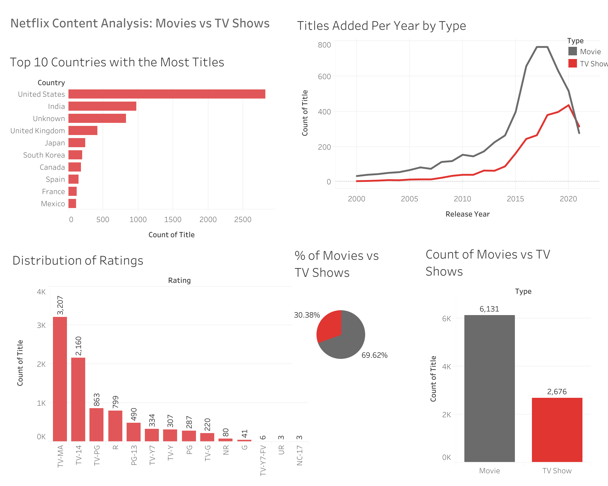

## Step 1. Kick-off meeting with management

Imagine you've just joined a media insights consultancy that works with streaming platforms to help them understand viewer content preferences. One of your clients is a growing streaming service looking to better understand how their library compares to global trends — particularly Netflix, the market leader.

They’re trying to decide what types of content to invest in — should they prioritize producing more TV shows or movies? Should they focus on content in certain countries or genres? And what content ratings (like PG-13, TV-MA, etc.) appeal to a broader audience?

They’ve asked your team to analyze Netflix's publicly available dataset to uncover key insights. Your job is to clean and explore the data, use SQL to slice and filter it, and present your findings in Tableau through clear visualizations.

---

## Step 2. Documenting a task during a meeting

**Goal**:
- What’s the distribution of content type over the years?
- Which countries produce the most content on Netflix?
- How does content rating vary by type (Movie vs TV Show)?
- Are there shifts in what kinds of content Netflix has been releasing?

---

## Tools Used

- Python
- Pandas
- Excel

---

## What This Project Does

1. Loads raw `.csv` coffee sales data into a Pandas DataFrame
2. Cleans the data by:
   - Removing missing values
   - Dropping duplicates
   - Cleaning columns
4. Exports the cleaned data to an Excel file

---
[Link Tableau](https://public.tableau.com/views/NetflixContentAnalysisMoviesvsTVShows/NetflixTitlesDashboard?:language=en-US&:sid=&:redirect=auth&:display_count=n&:origin=viz_share_link)

---

**Assessment**: This analysis explores Netflix’s content library from 2000 to 2021, focusing on trends in content type, country of origin, and maturity ratings.

Content Type Over Time: From 2000 to 2020, Netflix consistently added more Movies than TV Shows annually. A notable shift occurred in 2021, when TV Shows surpassed Movies for the first time (315 vs. 277 titles). The years 2017 and 2018 marked the peak in Movie additions, indicating a historical prioritization of film content up until that shift.

Country Distribution: The United States overwhelmingly leads in content production on Netflix, surpassing the second-highest contributor, India, by 1,846 titles. This highlights the platform’s heavy reliance on U.S.-based content.

Rating Distribution by Type: Movies appear across all content ratings, while TV Shows are missing in four rating categories. However, TV Shows have more titles in family-friendly categories such as TV-Y and TV-Y7. In all other rating groups, Movies dominate.

Overall Content Split: Movies make up 69.62% of the total Netflix catalog, with TV Shows accounting for 30.38%, reinforcing the platform’s historical emphasis on film content.

**Quick Summary Notes**:

- From 2000–2021, Netflix added more Movies than TV Shows each year.
- In 2021, TV Shows surpassed Movies in yearly additions.
- 2017 & 2018 saw the biggest spike in Movie releases.
- The United States produces the most content on Netflix—far more than any other country.
- Movies appear in all rating categories; TV Shows are missing in four.
- TV Shows have more titles in family-friendly ratings (TV-Y, TV-Y7).
- Overall content split:
  - Movies = 69.62%
  - TV Shows = 30.38%